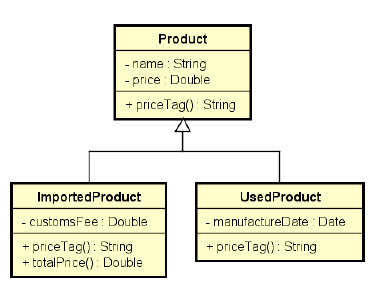
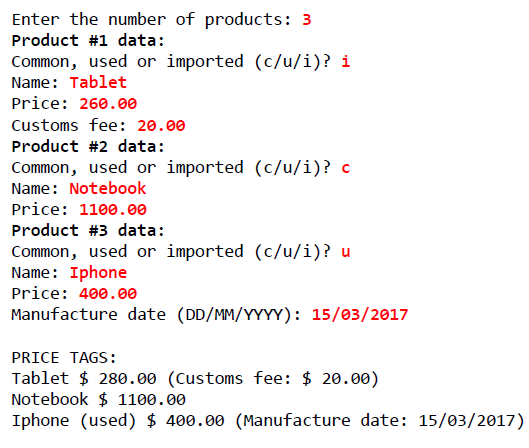

# Product Management



> Trata-se de um mini projeto simples programado em **Java**, que visa usar os principais conceitos da POO (Encapsulamento, herança e polimorfismo) em um sistema que tem por objetivo mostrar a etiqueta de preço dos produtos adicionados a uma lista em tempo de execução.



## 💻 Pré-requisitos

Antes de começar, verifique se você atendeu aos seguintes requisitos:
<!---Estes são apenas requisitos de exemplo. Adicionar, duplicar ou remover conforme necessário--->
* Você precisa compreender a linguagem Java e conceitos de POO (Encapsulamento, herança e polimorfismo)
* Você precisa compreender **Upcasting e Downcasting**
* Você precisa compreender conceito de delegação
<!--* Você leu `<guia / link / documentação_relacionada_ao_projeto>`.-->

### Ajustes e melhorias

O projeto ainda está em desenvolvimento e as próximas atualizações serão voltadas nas seguintes tarefas:

- [ ] Melhorar encapsulamento das classes
- [ ] Implementar interface
- [x] Implementar polimorfismo
- [x] Aplicar o conceito de delegação de classes
- [x] Implementar mascara de datas
## 🚀 Instalando <Order client>

Para instalar o <Order>, siga estas etapas:

Linux, macOS e Windows:
```
<git clone git@github.com:AlissonWenceslau/product-management.git >
```
###### Próximo passo
* Execute o projeto em uma IDE


[⬆ Voltar ao topo](#product-management)<br>